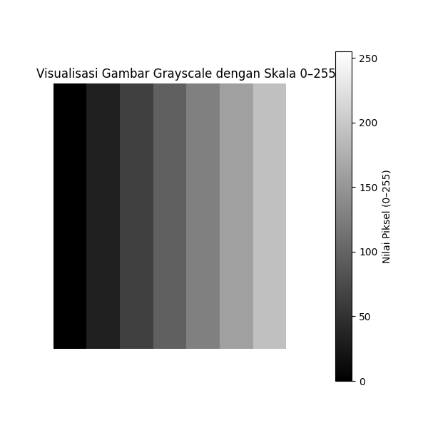
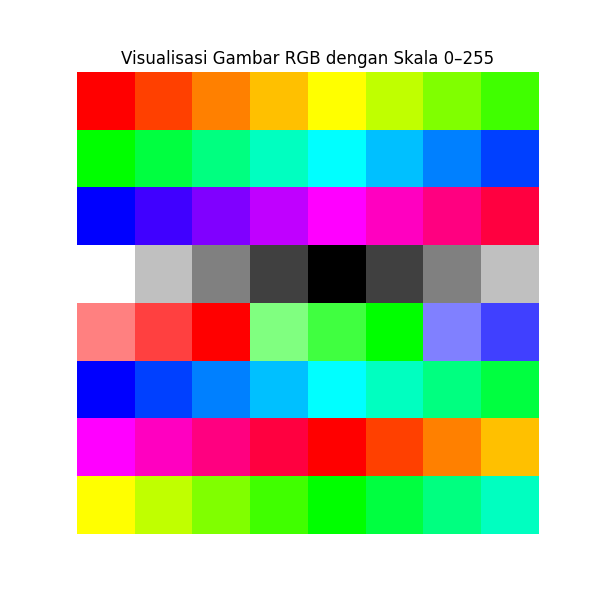

# Visualisasi Gambar Python

Proyek ini berisi contoh-contoh visualisasi gambar menggunakan Python, matplotlib, dan numpy.

## Struktur Proyek

```
project/
├── requirements.txt      # Dependensi proyek
├── src/                 # Kode sumber
│   ├── grayscale/      # Visualisasi gambar grayscale
│   └── rgb/            # Visualisasi gambar RGB
├── output/             # Hasil output gambar
│   ├── grayscale/     # Output gambar grayscale
│   └── rgb/           # Output gambar RGB
└── README.md          # Dokumentasi proyek
```

## Contoh Visualisasi

### 1. Grayscale
#### Visualisasi Gambar Grayscale dengan Skala 0–255
Membuat gambar grayscale 8x8 dengan gradasi dari hitam (0) ke putih (255).

```python
# Buat gambar grayscale sederhana 8x8
grayscale_image = np.array([
    [0, 32, 64, 96, 128, 160, 192, 255],
    [0, 32, 64, 96, 128, 160, 192, 255],
    [0, 32, 64, 96, 128, 160, 192, 255],
    [0, 32, 64, 96, 128, 160, 192, 255],
    [0, 32, 64, 96, 128, 160, 192, 255],
    [0, 32, 64, 96, 128, 160, 192, 255],
    [0, 32, 64, 96, 128, 160, 192, 255],
    [0, 32, 64, 96, 128, 160, 192, 255]
], dtype=np.uint8)
```

Hasil visualisasi:



### 2. RGB

#### a. Visualisasi Gradasi Warna RGB
Membuat pola warna RGB 8x8 dengan berbagai kombinasi nilai R, G, dan B.

```python
# Contoh baris pertama dari gambar RGB
rgb_first_row = [
    [255, 0, 0],    # Merah
    [255, 64, 0],   # Merah-Oranye
    [255, 128, 0],  # Oranye
    [255, 192, 0],  # Kuning-Oranye
    [255, 255, 0],  # Kuning
    [192, 255, 0],  # Kuning-Hijau
    [128, 255, 0],  # Hijau Muda
    [64, 255, 0]    # Hijau
]
```

```python
# Buat gambar RGB sederhana 8x8 dengan nilai piksel nyata (0–255)
rgb_image = np.array([
    [[255, 0, 0], [255, 64, 0], [255, 128, 0], [255, 192, 0], [255, 255, 0], [192, 255, 0], [128, 255, 0], [64, 255, 0]],
    [[0, 255, 0], [0, 255, 64], [0, 255, 128], [0, 255, 192], [0, 255, 255], [0, 192, 255], [0, 128, 255], [0, 64, 255]],
    [[0, 0, 255], [64, 0, 255], [128, 0, 255], [192, 0, 255], [255, 0, 255], [255, 0, 192], [255, 0, 128], [255, 0, 64]],
    [[255, 255, 255], [192, 192, 192], [128, 128, 128], [64, 64, 64], [0, 0, 0], [64, 64, 64], [128, 128, 128], [192, 192, 192]],
    [[255, 128, 128], [255, 64, 64], [255, 0, 0], [128, 255, 128], [64, 255, 64], [0, 255, 0], [128, 128, 255], [64, 64, 255]],
    [[0, 0, 255], [0, 64, 255], [0, 128, 255], [0, 192, 255], [0, 255, 255], [0, 255, 192], [0, 255, 128], [0, 255, 64]],
    [[255, 0, 255], [255, 0, 192], [255, 0, 128], [255, 0, 64], [255, 0, 0], [255, 64, 0], [255, 128, 0], [255, 192, 0]],
    [[255, 255, 0], [192, 255, 0], [128, 255, 0], [64, 255, 0], [0, 255, 0], [0, 255, 64], [0, 255, 128], [0, 255, 192]]
], dtype=np.uint8)

```

Hasil visualisasi:



#### b. Contoh Gambar RGB: Ikon Kucing
Membuat ikon kucing sederhana menggunakan kombinasi warna RGB.

```python
# Warna yang digunakan
WHITE = [255, 255, 255]  # Putih (background)
BLACK = [0, 0, 0]        # Hitam (kontur)
PINK = [255, 192, 203]   # Pink (telinga)
HOT_PINK = [255, 105, 180]  # Pink Terang (hidung)

# Contoh baris pertama dari ikon kucing
cat_first_row = [
    WHITE, BLACK, PINK, WHITE, WHITE, PINK, BLACK, WHITE
]
```

```python
# Buat contoh sederhana gambar hewan (ikon kucing) dengan array RGB 8x8
# Warna: Putih (background), Hitam (kontur), Pink (telinga, hidung)
cat_image = np.array([
    [[255, 255, 255], [0, 0, 0],     [255, 192, 203], [255, 255, 255], [255, 255, 255], [255, 192, 203], [0, 0, 0],     [255, 255, 255]],
    [[0, 0, 0],       [0, 0, 0],     [0, 0, 0],       [0, 0, 0],       [0, 0, 0],       [0, 0, 0],       [0, 0, 0],     [0, 0, 0]],
    [[0, 0, 0],       [255, 255, 255],[0, 0, 0],      [255, 255, 255], [255, 255, 255], [0, 0, 0],       [255, 255, 255],[0, 0, 0]],
    [[0, 0, 0],       [255, 255, 255],[255, 255, 255],[255, 105, 180], [255, 105, 180], [255, 255, 255], [255, 255, 255],[0, 0, 0]],
    [[0, 0, 0],       [255, 255, 255],[0, 0, 0],      [255, 255, 255], [255, 255, 255], [0, 0, 0],       [255, 255, 255],[0, 0, 0]],
    [[0, 0, 0],       [0, 0, 0],     [255, 255, 255], [0, 0, 0],       [0, 0, 0],       [255, 255, 255], [0, 0, 0],     [0, 0, 0]],
    [[255, 255, 255], [0, 0, 0],     [0, 0, 0],       [0, 0, 0],       [0, 0, 0],       [0, 0, 0],       [0, 0, 0],     [255, 255, 255]],
    [[255, 255, 255], [255, 255, 255],[0, 0, 0],      [0, 0, 0],       [0, 0, 0],       [0, 0, 0],       [255, 255, 255],[255, 255, 255]]
], dtype=np.uint8)
```
Hasil visualisasi:


## Cara Menjalankan

1. Install dependensi:
   ```bash
   pip install -r requirements.txt
   ```

2. Jalankan script:
   ```bash
   # Visualisasi Grayscale
   python src/grayscale/visualize_grayscale.py

   # Visualisasi RGB Scale
   python src/rgb/visualize_rgb_scale.py

   # Visualisasi Ikon Kucing RGB
   python src/rgb/visualize_rgb_cat.py
   ```

3. Hasil visualisasi akan disimpan di folder `output/` masing-masing direktori:
   - Grayscale: `src/grayscale/output/grayscale/grayscale_scale.png`
   - RGB Scale: `src/rgb/output/rgb/rgb_scale.png`
   - RGB Cat: `src/rgb/output/rgb/rgb_cat.png` 